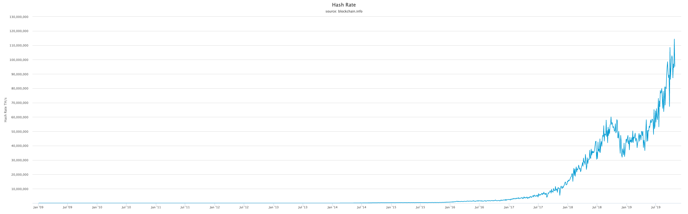

# 区块链小白书

李笑来（著）&copy; 2019

-----

[toc]

## 警告

> 区块链作为金融互联网新技术，不可避免地会涉及到投资和投机 —— 而对绝大多数普通人来说：
>
> > **投资有风险，决策需谨慎！**

## 前言

[新华社北京10月25日电](http://www.xinhuanet.com/politics/2019-10/25/c_1125153665.htm)，中共中央政治局10月24日下午就区块链技术发展现状和趋势进行第十八次集体学习。

> 中共中央总书记习近平在主持学习时强调，区块链技术的集成应用在新的技术革新和产业变革中起着重要作用。我们要把区块链作为核心技术自主创新的重要突破口，明确主攻方向，加大投入力度，着力攻克一批关键核心技术，加快推动区块链技术和产业创新发展。
>
> 习近平在主持学习时发表了讲话。他指出，区块链技术应用已延伸到数字金融、物联网、智能制造、供应链管理、数字资产交易等多个领域。目前，全球主要国家都在加快布局区块链技术发展。我国在区块链领域拥有良好基础，要加快推动区块链技术和产业创新发展，积极推进区块链和经济社会融合发展。
>
> 习近平强调，要强化基础研究，提升原始创新能力，努力让我国在区块链这个新兴领域走在理论最前沿、占据创新制高点、取得产业新优势。要推动协同攻关，加快推进核心技术突破，为区块链应用发展提供安全可控的技术支撑。要加强区块链标准化研究，提升国际话语权和规则制定权。要加快产业发展，发挥好市场优势，进一步打通创新链、应用链、价值链。要构建区块链产业生态，加快区块链和人工智能、大数据、物联网等前沿信息技术的深度融合，推动集成创新和融合应用。要加强人才队伍建设，建立完善人才培养体系，打造多种形式的高层次人才培养平台，培育一批领军人物和高水平创新团队。
>
> 习近平指出，要抓住区块链技术融合、功能拓展、产业细分的契机，发挥区块链在促进数据共享、优化业务流程、降低运营成本、提升协同效率、建设可信体系等方面的作用。要推动区块链和实体经济深度融合，解决中小企业贷款融资难、银行风控难、部门监管难等问题。要利用区块链技术探索数字经济模式创新，为打造便捷高效、公平竞争、稳定透明的营商环境提供动力，为推进供给侧结构性改革、实现各行业供需有效对接提供服务，为加快新旧动能接续转换、推动经济高质量发展提供支撑。要探索“区块链+”在民生领域的运用，积极推动区块链技术在教育、就业、养老、精准脱贫、医疗健康、商品防伪、食品安全、公益、社会救助等领域的应用，为人民群众提供更加智能、更加便捷、更加优质的公共服务。要推动区块链底层技术服务和新型智慧城市建设相结合，探索在信息基础设施、智慧交通、能源电力等领域的推广应用，提升城市管理的智能化、精准化水平。要利用区块链技术促进城市间在信息、资金、人才、征信等方面更大规模的互联互通，保障生产要素在区域内有序高效流动。要探索利用区块链数据共享模式，实现政务数据跨部门、跨区域共同维护和利用，促进业务协同办理，深化“最多跑一次”改革，为人民群众带来更好的政务服务体验。
>
> 习近平强调，要加强对区块链技术的引导和规范，加强对区块链安全风险的研究和分析，密切跟踪发展动态，积极探索发展规律。要探索建立适应区块链技术机制的安全保障体系，引导和推动区块链开发者、平台运营者加强行业自律、落实安全责任。要把依法治网落实到区块链管理中，推动区块链安全有序发展。
>
> 习近平指出，相关部门及其负责领导同志要注意区块链技术发展现状和趋势，提高运用和管理区块链技术能力，使区块链技术在建设网络强国、发展数字经济、助力经济社会发展等方面发挥更大作用。

到了 2019 年，是李笑来在区块链世界里生存的第 9 个年头。这些年来，人们对区块链的误解甚至诋毁现在终于可以烟消云散了 —— 因为区块链技术终于在中国获得了认可与支持。

然而，需要注意的是，区块链技术作为金融互联网新技术，不可避免地与投机（或投资）联系在一起，导致的结果是市场上骗局丛生，行业里鱼龙混杂，所以有必要让民众对区块链有正确且有清楚的了解。这就是《区块链小白书》的意义 —— 它就是写给小白的，目的就是为了让小白少走弯路，更是为了让小白不要误入歧途。

李笑来，二〇一九年十一月，于北京

## 准备工作

### 1. 不要滥用类比

你将要尝试着学习并理解的，是一个前所未有的重大创新，其中有很多你一下子难以理解透彻的概念，很少有人能一下子全都弄明白…… 

在这样的时候，人们会不由自主地抄近路走捷径 —— 滥用类比：

> “哦！ 我明白了，这就好像是……” 

比如，你经常会看到人们挣扎着理解了半天，突然冒出一句：“哦，我懂了，比特币就是电子黄金！” **类比**是约等号（≈），而“**这就是**”是等号（=），约等号和等号之间的差别有时甚至超过十万八千里。 比特币与电子黄金之间的关系甚至干脆就谈不上是约等于…… 全然不是一个东西。

在理解全新事物的时候，滥用类比的危害非常大，因为你压根就找不到什么过往已经存在的东西真的和这个创新竟然一模一样 —— 否则，它也不可能被称为创新了，是不是？

这种不恰当的类比被滥用多次之后，就再也没办法形成正确的理解了 —— 因为理解一个创新需要理解多个前所未有的概念，每个都做了不恰当的类比之后，多次非常不恰当的**约等于**拼接起来之后，无论如何都没办法形成一个与正确理解相近的效果。

请务必注意，每次你的脑子里不由自主地冒出 “这就好像……” 这个念头的时候，你都要把它强压回去。

### 2. 重复重复再重复

遇到暂时无法理解的概念，不要担心、不要纠结、不要停顿，你要做的事情很简单：

> * 继续读下去；
> * 读完之后再**重复读很多次**……

这是学习任何新知识或者在任何新领域探索的 “必杀技”。这背后一个重要的原理：

> 绝大多数难以理解的知识，是因为它内部有很多 “前置引用”。

所谓的前置引用，就是一个在后面才能深入理解的概念竟然在此之前已经被引用了，导致的结果是学习者总是处于懵懂的状态。学校里的知识不是这样的，学校里的知识总是线性层层递进的，理解了前面，就能理解后面…… 关于 “前置引用”，你可以参阅我在《[自学是门手艺](https://github.com/selfteaching/the-craft-of-selfteaching/blob/master/Part.1.F.deal-with-forward-references.ipynb)》里的阐述。

“硬着头皮读完，而后重复读很多次” 这个策略，就是可以轻松突破 “前置引用” 所设置的障碍。这个技巧，事实上可以用在任何领域。

### 3.借助群智的力量

快速掌握新知识，快速适应新领域，还有个重要的技巧，就是借助群智的力量。事实上，在学校里，你早就应该发现这个技巧了 —— 如果你能跟那些学霸经常聊天，经常玩耍，你就会发现总是在不经意之间，很多重点难点就那样轻而易举地被解决掉了……

这首先因为人是社交动物，然而更为重要的是，交流这个东西，随意的交流总是比刻意的交流更为有效 —— 因为随意的交流总是刻意解决那些连你自己都没意识到的问题…… 可偏偏，这些你自己意识不到的问题恰恰是最重要甚至最关键的问题。如果不借助这种群智的力量，很难想象还有什么办法可以解决这种隐秘的关键问题。

在 [Mixin Messenger](https://mixin.one/messenger) 上，有一个群，群号是 *7000102093*，里面有一万多人 —— 可能是目前国内最优质的小白社群。群里定期有公开课，并且定期会开放聊天机会…… 在那里，你可以向别人提问，也可以观察他人之间的讨论，很多你弄不明白的问题，可能一不小心之间就彻底被他人的对话解决掉了。

## 比特币

比特币是个前所未有的东西，所以绝大多数人很难清楚地理解它。这一个章节之中，我们会用极为简单的语言尽量做到通俗易懂 —— 并且，尽量不涉及那些晦涩难懂的技术概念。

### 1. 什么是比特币

2009 年，[比特币](https://bitcoin.org)横空出世，绝大多数人对此全然不知。即便是在 10 年后的今天，比特币对大众来说也依然神秘…… 不过，总是可以用很简单的方式说清楚：

> 理解比特币最简单的方法是把它想象成一家世界银行：

> > 这家叫 Bitcoin 的世界银行发行了一个叫做 BTC 的货币……

基于翻译的局限，无论是 Bitcoin 还是 BTC，在中文之中都叫 “比特币”。

对中国民众来说，最大的狐疑来自于 “银行是谁都可以开的么？”，以及 “货币这东西你说发就发啊？”…… 刚开始的时候这确实难以理解，甚至难以接受。可科技发展已经给我们演示过很多次 “过去完全不可能的事情竟然就那么发生了！” 电子邮件就那样悄无声息地替代了书信，互联网语音通讯就那么不声不响地替代了电话。

### 2. 比特币其实不可能替代法币

对于新生事物，人们总说过于两极分化，要么断然拒绝接受，要么对它寄予过分的期待。比特币不可能替代法币（Fiat Money，法定货币）—— 只因为最简单的原因：

> 日常生活中人们需要的货币必须是价格相对稳定的。

在可预见的未来相当长一段时间里，比特币的价格不可能稳定；恰恰相反，它的价格波动剧烈 —— 仅此一点，就使得它没办法成为日常生活中人们所最普遍使用的货币。

长期来看，即便比特币的价格因为绝大多数人都接受而趋于稳定，它也只不过会成为地球上众多货币之中的一个而已，不可能替代所有法币。

### 3. 比特币解决了什么问题

如果你有兴趣耐心反复阅读比特币白皮书，《[比特币：一种点对点的电子现金系统](https://github.com/xiaolai/bitcoin-whitepaper-chinese-translation)》，那么你就会发现一个你之前并不了解的概念是它的核心：

> 双花问题（Double Spending）

简单讲，就是“同一笔钱一次只能花在一个地方”，“绝对不能让同一笔钱竟然同时花到了两个地方”，否则就只能是 “记账有误”。银行的核心业务是什么呢？银行的最核心业务其实只有一个，那就是：**记账** —— 绝对不能记错账，更不应该做假账。

数字时代的尴尬在于，传统中心化管理的数据库，用来记账的时候，那账簿是有无数种可能被篡改的，账本上随意增加一条不合理的记录、随意删除一条不合规的记录，随意修改任何记录中的数字，都有可能且违规干脆无法防范……

那怎么办呢？比特币这家世界银行的解决方案很简单：

> * 我不自己管理数据库了；
> * 把这个数据库的管理权限交给所有人，大家共同维护这个账簿；
> * 每个人手中所持有的账簿必须与其他人的一样才算有效账簿；
> * 所以，全网所有的账簿都只能一样；
> * 所以，没有人可以私自篡改账簿并被所有其他人接受……

如此这般，就保证了这家世界银行的账簿不可能出错，不可能被恶意篡改，不可能再出现任何 “同一笔钱竟然同时花在两个地方” 的情况。

于是，逻辑就很清晰了：

> * **问题**是 “必须要有一个不可篡改的可信账簿……”
> * **解决方案**是 “那我们分布式管理罢！”

你看，“去中心化” 并非目标，而是分布式管理的结果；而 “公开透明” 也只是分布式管理的自然而然的结果…… 多年以来，不明就里的人们总是神话 “去中心化” 带来的颠覆，总是神话 “公开透明” 的各种优势 —— 其实是本末倒置了。去中心化指的是网络结构去中心化，不会直接带来任何颠覆。而公开透明，固然在一些地方必需必要，但，事实上绝大多数商业模式在公开透明的方式下无法良好运营。别说商业模式了，连游戏都是这样的，猜大小游戏可以一直公开透明，可棋牌游戏，必须等到游戏结束之后才可以公开透明，否则游戏就无法进行了……

### 4. 区块链究竟是什么

区块链是 blockchain 这个英文新词汇的 “生硬翻译” —— 事实上，绝大多数翻译就是很生硬的，你看看上面的 “双花”（Double Spending）就能感觉到了。

所谓**区块**，是 *block* 的翻译，可以理解为 “信息块”（这个单词在计算机领域就是这个意思）。

> **block**, *Computing*: a large piece of text processed as a unit.

如此这般，**区块链**（blockchain）就是字面上的意思，它就是由前后链接起来的信息块构成。

在比特币这家世界银行的设计中，区块（block），就是一个又一个不断生成的**子账簿**，这些子账簿通过一种特定的算法（哈希算法）前后链接起来，形成**总账簿**（blockchain）。从这个角度望过去，区块链技术没什么神秘的，通俗地讲，它就是一种新的记账技术而已。

比特币这家世界银行，就是这样建立在区块链技术上的第一个分布式应用。而区块链技术，通俗地讲，无非是个不可篡改的分布式数据库技术而已。

### 5. 区块链技术会改变世界吗

在一些场景下，这个世界的确需要不可篡改的数据库技术。比如，法院的卷宗，交通部门的违章记录，工商部门的企业登记，民政局的婚姻登记，公安局的身份证，大学的毕业证，等等等等……

尤其需要区块链技术的领域，除了**公共事务领域**之外，还有**物联网**。机器产生数据的速度和数量都远远超过人类，而机器数量未来也会必然远远超出人口的数量不止几个量级…… 面对未来不可想象地庞大的物联网世界，不可篡改的数据记录绝对不可或缺 —— 甚至可以说，没有区块链技术，未来的物联网世界不可能安全发展。

所以说，区块链技术的确会改变世界。

不过，至于区块链技术究竟在将来会把这个时间变成什么样子，今天的我们很难准确预测。历史证明，每次技术革新出现的时候，我们的想象力都极为困乏，我们的预测能力都聊胜于无。三四十年前，人们想象互联网是这样改变世界的：

> 到时候你给别人写信，就会变成这样：你在这边敲完，那边的打印机就自动把整个信件打印出来了……

事实上，没有任何一个专家能在四十年前想象出我们今天可以拿着一个掌中设备坐在家里点两下一会儿外卖就送到门口了…… 所以，过多的预测和想象，实际上是徒劳无益的。

### 6. 挖矿是怎么回事

比特币这家世界银行想出来的维护账簿的方式是使用分布式网络，那么就需要吸引足够多的节点来参与 —— 节点数量越多，网络越安全。可问题在于：

> 人家凭什么来参与呢？

所以，比特币这家世界银行吸引大家参与分布式网络建设的方法是：

> **每 10 分钟左右发一次 “红包”**……

这里的 “10 分钟”，是因为比特币这个分布式网络每十分钟要完成一个子账簿（就是一个区块），而后把这个新的子账簿附加到原来的总账之中（即，区块链）。生成、校验子账簿，并且确认无误地附加到原来的总账之中，这个过程需要网络中的节点贡献算力。而算力并不是白白贡献的，大家干活了之后，就可以参与 ”抢红包“！

比特币这家世界银行通过不断地 “发红包” 完成了它的货币发行 —— 按照程序最初的设定，比特币这家世界银行（Bitcoin）要持续发红包 142 年！刚开始的时候每 10 分钟左右发 50 个比特币（BTC），以后每 4 年减半一次，每个 “红包” 里的比特币数量从 50 个变成 25 个，后来再变成 12.5 个，6.25 个…… 以此类推。比特币（BTC）总量为恒定的 2,100 万个 —— 红包全部发完之后，参与网络维护的节点依然可以通过分享网络转账手续费而获益。

通过架设比特币节点获利的过程，被人们形象地称为 “挖矿”（mining），而参与建设节点的那些人被人们称为 “矿工”（miners）。因为 “抢红包” 是有一定运气因素存在的行为，所以，矿工们会集中挖矿，方式是把自己的节点算力集中到一个 “矿池”（mining pool）之中，以便增加自己抢红包时的运气。目前全球排名第一的矿池是[币印矿池](https://poolin.com)。

十年前，比特币网络刚刚运行的时候，参与人数少，总算力也很低，那时候随便用一台笔记本电脑就可以 “挖” 出很多比特币 —— 当然，那时候的比特币也不值钱…… 第一笔比特币交易是，有人用 25 万个比特币买了一个披萨！

> 上图来自：https://www.blockchain.com/charts/hash-rate?timespan=all

时至今日，比特币网络算力已经大到惊人的地步，不实用专门定制的计算机（所谓 “矿机”）是很难 “挖” 出比特币的。矿机的发展，经过了 CPU 时代，GPU 时代，早就进入了 ASIC 时代，并且，从 128 纳米的芯片几经升级，目前已经有公司在研究 7 纳米、甚至 5 纳米的比特币挖矿芯片了。

### 7. 比特币凭什么涨啊涨

如果你能把比特币（BTC）理解为 “一个叫做比特币（Bitcoin）的这个分布式世界银行应用” 的股票，那么就比较容易理解比特币（BTC）的价格上涨趋势了。

.png)

> 上图来自 https://www.blockchain.com/charts/market-price?timespan=all

这个叫做比特币（Bitcoin）的这个分布式世界银行应用就好像是一家上市公司，它的核心业务只有两个部分：发行和记账。而它的价值取决于有多少人认同它、使用它 —— 在这一方面，地球上任何一家银行都如此。截至 2019 年，全球使用比特币的人数不超过 3000 万，相对于整个人口数量，这依然是个相当小的比例。所以，它还有很大的上涨空间 —— 只不过，在任何一个短期之内，上下波动都非常剧烈，所以，普通人参与投机的风险非常高。

### 8. 区块链有没有被篡改的风险

事实上，仅仅分布式管理本身，是无法做到 “无法篡改” 的 —— 顶多能做到的是 “很难篡改”。假设全网诸多节点中有 51% 的节点联合起来 —— 不管是善意还是恶意，反正都是故意 —— 那么这些节点 “合谋” 的结果就是该数据库不再是 “不可篡改” 的数据库。

以上所描述的情况，就是所谓的 “51 攻击” —— 这并不是技术能够解决的问题。区块链的第一个应用，比特币，解决这个问题的方式，同样不是靠技术，而是靠利益驱动（博弈原理）：

> 若是真的有谁能够操纵 51% 的算力，那么他会发现，对他来说，“贡献” 远比 “攻击” 更有利可图。

### 10. 小白如何购买比特币

目前世界上对小白最友好的多币种钱包是 [Mixin Messenger](https://mixin.one/messsenger)，它不仅支持你所能听说过的绝大多数数字资产收发与存储，并且使用极为方便。

Mixin 下载方式：

> * iOS
>   * 国内用户，在 iTunes [下载 Mixin 畅聊版](https://apps.apple.com/cn/app/mixin-%E5%AF%86%E4%BF%A1%E7%95%85%E8%81%8A%E7%89%88/id1457938019)
>   * 国外用户，在 iTunes [下载 Mixin Messenger](https://apps.apple.com/app/mixin/id1322324266)
> * Android
>   * 国内用户，在[腾讯应用宝下载](https://a.app.qq.com/o/simple.jsp?pkgname=one.mixin.messenger)，或者[小米应用商店下载](http://app.mi.com/details?id=one.mixin.messenger)
>   * 国外用户，在 [Google Play Store 下载](https://play.google.com/store/apps/details?id=one.mixin.messenger)

iOS 国内用户下载的 [Mixin 畅聊版](https://apps.apple.com/cn/app/mixin-%E5%AF%86%E4%BF%A1%E7%95%85%E8%81%8A%E7%89%88/id1457938019) 需要添加小钱包机器人（ID: *7000101425*）才能使用数字资产收发存储功能。

在 Mixin 里提供 OTC 服务的是 exin，机器人 ID：7000101276。

你也可以到 https://big.one，这是国内老牌交易所云币团队打造的有信誉保障的区块链数字资产交易所，可以使用 USDT 购买比特币，它也有 [OTC 服务](https://otc.big.one/trade)。另外，Big.One 的 Mixin 大群 ID 是：*7000101910*。

再次需要提醒风险：

> 区块链数字资产价格波动巨大，**投资有风险，决策需谨慎！**

另外，对小白来说最靠谱的投资策略是**定投策略** —— 至于具体应该如何操作，请移步[《定投改变命运》（开源第三版）](https://onregularinvesting.com)。

