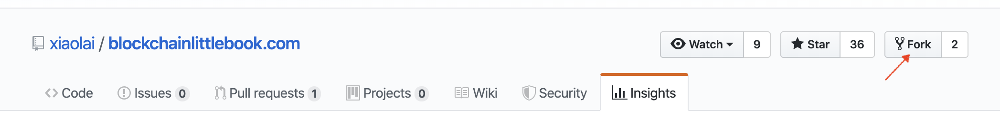
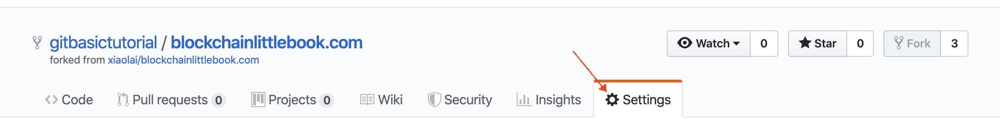
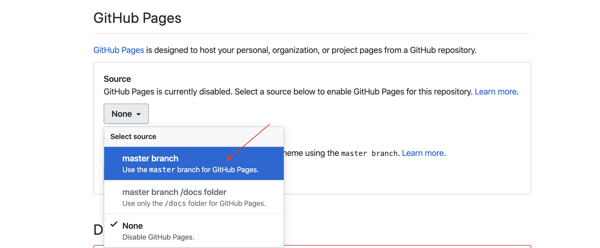
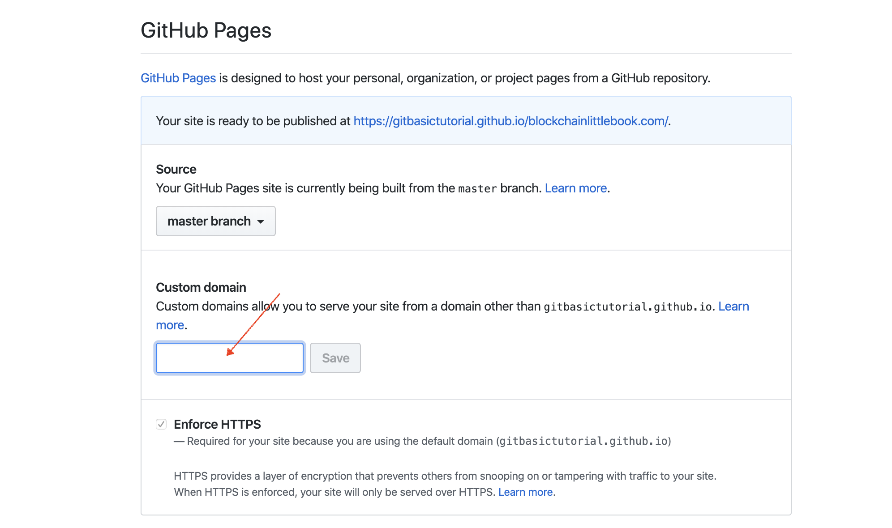
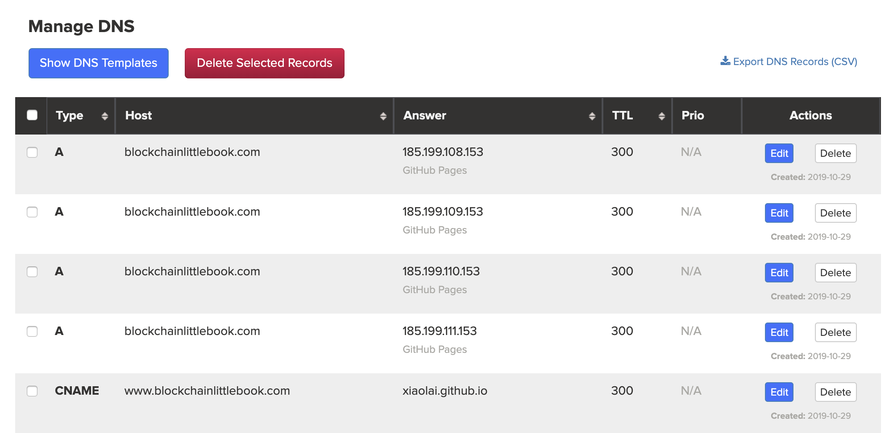

# 区块链小白书批注版

[李笑来](http://lixiaolai.com)（著）&copy; [JKR Family](http://jkrfamily.com)（批注）2019

-----

## 警告

> 区块链作为金融互联网新技术，不可避免地会涉及到投资和投机 —— 而对绝大多数普通人来说：
>
> > **投资有风险，决策需谨慎！**

**<小刀批注>**

李老师的话要听，李老师的币不要买，这是颠扑不破的道理，这本书里面李老师所提到的EOS，可以理解成是跟李老师有利益关系的，所以，决策须谨慎！

**</小刀批注>**

**<墨客批注>**

**李话要听，李币勿买。**
能否听得懂这句话代表你是否真的进了币圈。

**</墨客批注>**

## 前言

[新华社北京10月25日电](http://www.xinhuanet.com/politics/2019-10/25/c_1125153665.htm)，中共中央政治局10月24日下午就区块链技术发展现状和趋势进行第十八次集体学习。

> 中共中央总书记习近平在主持学习时强调，区块链技术的集成应用在新的技术革新和产业变革中起着重要作用。我们要把区块链作为核心技术自主创新的重要突破口，明确主攻方向，加大投入力度，着力攻克一批关键核心技术，加快推动区块链技术和产业创新发展。
>
> 习近平在主持学习时发表了讲话。他指出，区块链技术应用已延伸到数字金融、物联网、智能制造、供应链管理、数字资产交易等多个领域。目前，全球主要国家都在加快布局区块链技术发展。我国在区块链领域拥有良好基础，要加快推动区块链技术和产业创新发展，积极推进区块链和经济社会融合发展。
>
> 习近平强调，要强化基础研究，提升原始创新能力，努力让我国在区块链这个新兴领域走在理论最前沿、占据创新制高点、取得产业新优势。要推动协同攻关，加快推进核心技术突破，为区块链应用发展提供安全可控的技术支撑。要加强区块链标准化研究，提升国际话语权和规则制定权。要加快产业发展，发挥好市场优势，进一步打通创新链、应用链、价值链。要构建区块链产业生态，加快区块链和人工智能、大数据、物联网等前沿信息技术的深度融合，推动集成创新和融合应用。要加强人才队伍建设，建立完善人才培养体系，打造多种形式的高层次人才培养平台，培育一批领军人物和高水平创新团队。
>
> ……

到了 2019 年，是李笑来在区块链世界里生存的第 9 个年头。这些年来，人们对区块链的误解甚至诋毁现在终于可以烟消云散了 —— 因为区块链技术终于在中国获得了认可与支持。

然而，需要注意的是，区块链技术作为金融互联网新技术，不可避免地与投机（或投资）联系在一起，导致的结果是市场上骗局丛生，行业里鱼龙混杂，所以有必要让民众对区块链有正确且清楚的了解。这就是《区块链小白书》的意义 —— 它就是写给小白的，目的不仅是为了让小白少走弯路，更是为了让小白不要误入歧途。

**<小刀批注>**

李老师说这种话心里不会痛的吗？歧途不是李老师一点点用手挖出来的吗？李老师微博上的一句话用来形容自己可能最合适不过了：“你这一生遇到的所谓坏人，都是上帝派来教你做人的 —— 只不过这些老师都下手比较狠而已。”

**</小刀批注>**

李笑来，二〇一九年十月，于北京

## 准备工作

### 1. 不要滥用类比

你将要尝试着学习并理解的，是一个前所未有的重大创新，其中有很多你一下子难以理解透彻的概念，很少有人能一下子全都弄明白…… 

在这样的时候，人们会不由自主地抄近路走捷径 —— 滥用类比：

> “哦！ 我明白了，这就好像是……” 

比如，你经常会看到人们挣扎着理解了半天，突然冒出一句：“哦，我懂了，比特币就是电子黄金！” **类比**是约等号（≈），而“**这就是**”是等号（=），约等号和等号之间的差别有时甚至超过十万八千里。 比特币与电子黄金之间的关系甚至干脆就谈不上是约等于…… 全然不是一个东西。

在理解全新事物的时候，滥用类比的危害非常大，因为你压根就找不到什么过往已经存在的东西真的和这个创新竟然一模一样 —— 否则，它也不可能被称为创新了，是不是？

这种不恰当的类比被滥用多次之后，就再也没办法形成正确的理解了 —— 因为理解一个创新需要理解多个前所未有的概念，每个都做了不恰当的类比之后，多次非常不恰当的**约等于**拼接起来之后，无论如何都没办法达到一个与正确理解相近的效果。

请务必注意，每次你的脑子里不由自主地冒出 “这就好像……” 这个念头的时候，你都要把它强压回去。

### 2. 重复重复再重复

遇到暂时无法理解的概念，不要担心、不要纠结、不要停顿，你要做的事情很简单：

> * 继续读下去；
> * 读完之后再**重复读很多次**……

这是学习任何新知识或者在任何新领域探索的 “必杀技”。这背后有一个重要的原理：

> 绝大多数难以理解的知识，是因为它内部有很多 “前置引用”。

所谓的前置引用，就是一个在后面才能深入理解的概念竟然在此之前已经被引用了，导致的结果是学习者总是处于懵懂的状态。学校里的知识却不是这样的，学校里的知识总是线性层层递进的，理解了前面，就能理解后面…… 关于 “前置引用”，你可以参阅我在《[自学是门手艺](https://github.com/selfteaching/the-craft-of-selfteaching/blob/master/Part.1.F.deal-with-forward-references.ipynb)》里的阐述。

“硬着头皮读完，而后重复读很多次” 这个策略，就是可以轻松突破 “前置引用” 所设置的障碍。这个技巧，事实上可以用在任何领域。

### 3.借助群智的力量

快速掌握新知识，快速适应新领域，还有个重要的技巧，就是借助群智的力量。事实上，在学校里，你早就应该发现这个技巧了 —— 如果你能跟那些学霸经常聊天，经常玩耍，你就会发现总是在不经意之间，很多重点难点就那样轻而易举地被解决掉了……

这首先因为人是社交动物，然而更为重要的是，交流这个东西，随意的交流总是比刻意的交流更为有效 —— 因为随意的交流总是刻意解决那些连你自己都没意识到的问题…… 可偏偏，这些你自己意识不到的问题恰恰是最重要甚至最关键的问题。如果不借助这种群智的力量，很难想象还有什么办法可以解决这种隐秘的关键问题。

在 [Mixin Messenger](https://mixin.one/messenger) 上，有一个群，群号是 *7000102093*，里面有一万多人 —— 可能是目前国内最优质的小白社群。群里定期有公开课，并且定期会开放聊天机会…… 在那里，你可以向别人提问，也可以观察他人之间的讨论，很多你弄不明白的问题，可能一不小心就彻底被他人的对话解决掉了。

**<墨客批注>**

避免陷入群智陷阱**。在李老师的社群里面，李老师是有绝对统治力的。李老师说过他会踢掉很多跟他价值观不一致的人。当然实际踢掉的也有可能是跟他有利益冲突的人。例如在2018年Big.one（李老师的交易所）的平台币ONE无限下跌的时候，亏损的用户在群里面声讨李老师的，都会被踢掉。假如这是一个高级的杀猪群，那么让自己只听到一种声音，恰巧是把自己置于最危险的境地。

我们不做立场的预设，但是**认识这个世界，光暗的两面都见识是很重要的**。一个成熟的币圈人，会加入非常多的微信群（国外是电报推特），通过不同渠道的信息来做比对。我们也不是建议你不加入Mixin的李老师群组，但是我们非常建议你有更多的区块链信息渠道。

**</墨客批注>**

## 比特币

比特币是个前所未有的东西，所以绝大多数人很难清楚地理解它。这一个章节之中，我们会用极为简单的语言尽量做到通俗易懂 —— 并且，尽量不涉及那些晦涩难懂的技术概念。

### 1. 什么是比特币

2009 年，[比特币](https://bitcoin.org)横空出世，绝大多数人对此全然不知。即便是在 10 年后的今天，比特币对大众来说也依然神秘…… 不过，总是可以用很简单的方式说清楚：

> 理解比特币最简单的方法是把它想象成一家世界银行：

> > 这家叫 Bitcoin 的世界银行发行了一个叫作 BTC 的货币……

基于翻译的局限，无论是 Bitcoin 还是 BTC，在中文之中都叫 “比特币”。

对中国民众来说，最大的狐疑来自于 “银行是谁都可以开的么？”，以及 “货币这东西你说发就发啊？”…… 刚开始的时候这确实难以理解，甚至难以接受。可科技发展已经给我们演示过很多次 “过去完全不可能的事情竟然就那么发生了！” 电子邮件就那样悄无声息地替代了书信，互联网语音通讯就那么不声不响地替代了电话。

### 2. 比特币其实不可能替代法币

对于新生事物，人们总是过于两极分化，要么断然拒绝接受，要么对它寄予过分的期待。比特币不可能替代法币（Fiat Money，法定货币）—— 只因为最简单的原因：

> 日常生活中人们需要的货币必须是价格相对稳定的。

在可预见的未来相当长一段时间里，比特币的价格不可能稳定；恰恰相反，它的价格波动剧烈 —— 仅此一点，就使得它没办法成为日常生活中人们所最普遍使用的货币。

长期来看，即便比特币的价格因为绝大多数人都接受而趋于稳定，它也只不过会成为地球上众多货币之中的一个而已，仍旧不可能替代所有法币。

### 3. 比特币解决了什么问题

如果你有兴趣耐心反复阅读比特币白皮书，《[比特币：一种点对点的电子现金系统](https://github.com/xiaolai/bitcoin-whitepaper-chinese-translation)》，那么你就会发现一个你之前并不了解的概念是它的核心：

> 双花问题（[Double Spending](https://zh.wikipedia.org/zh-hans/%E9%9B%99%E9%87%8D%E6%94%AF%E4%BB%98)）

简单讲，就是“同一笔钱一次只能花在一个地方”，“绝对不能让同一笔钱竟然同时花到了两个地方”，否则就只能是 “记账有误”。银行的核心业务是什么呢？银行的最核心业务其实只有一个，那就是：**记账** —— 绝对不能记错账，更不应该做假账。

数字时代的尴尬在于，传统中心化管理的数据库，用来记账的时候，那账簿是有无数种可能被篡改的，账本上随意增加一条不合理的记录、随意删除一条不合规的记录，随意修改任何记录中的数字，都有可能违规且干脆无法防范……

那怎么办呢？比特币这家世界银行的解决方案很简单：

> * 我不自己管理数据库了；
> * 把这个数据库的管理权限交给所有人，大家共同维护这个账簿；
> * 每个人手中所持有的账簿必须与其他人的一样才算有效账簿；
> * 所以，全网所有的账簿都只能一样；
> * 所以，没有人可以私自篡改账簿并被所有其他人接受……

如此这般，就保证了这家世界银行的账簿不可能出错，不可能被恶意篡改，不可能再出现任何 “同一笔钱竟然同时花在两个地方” 的情况。

于是，逻辑就很清晰了：

> * **问题**是 “必须要有一个不可篡改的可信账簿……”
> * **解决方案**是 “那我们分布式管理罢！”

你看，“去中心化” 并非目标，而是分布式管理的结果；而 “公开透明” 也只是分布式管理的自然而然的结果…… 多年以来，不明就里的人们总是神话 “去中心化” 带来的颠覆，总是神话 “公开透明” 的各种优势 —— 其实是本末倒置了。去中心化指的是网络结构去中心化，不会直接带来任何颠覆。而公开透明，固然在一些地方必需必要，但，事实上绝大多数商业模式在公开透明的方式下无法良好运营。别说商业模式了，连游戏都是这样的，猜大小游戏可以一直公开透明，可棋牌游戏，必须等到游戏结束之后才可以公开透明，否则游戏就无法进行了……

### 4. 区块链究竟是什么

区块链是 blockchain 这个英文新词汇的 “生硬翻译” —— 事实上，绝大多数翻译就是很生硬的，你看看上面的 “双花”（Double Spending）就能感觉到了。

所谓**区块**，是 *block* 的翻译，可以理解为 “信息块”（这个单词在计算机领域就是这个意思）。

> **block**, *Computing*: a large piece of text processed as a unit.

如此这般，**区块链**（blockchain）就是字面上的意思，它就是由前后链接起来的信息块构成。

在比特币这家世界银行的设计中，区块（block），就是一个又一个不断生成的**子账簿**，这些子账簿通过一种特定的算法（哈希算法）前后链接起来，形成**总账簿**（blockchain）。从这个角度望过去，区块链技术没什么神秘的，通俗地讲，它只不过是一种新的记账技术而已。

比特币这家世界银行，就是这样建立在区块链技术上的第一个分布式应用。而区块链技术，通俗地讲，无非是个不可篡改的分布式数据库技术而已。

**<墨客批注>**

对于新技术的理解由于无数前置概念的存在，而导致理解困难。例如百度百科的定义“区块链是分布式数据存储、点对点传输、共识机制、加密算法等计算机技术的新型应用模式。”

对于一个普通人来说，他看到“分布式数据存储”、“点对点传输”、“共识机制”、“加密算法”，都蒙蔽了，怎么可能会理解这句话。当然如果你有时间一个一个关键词的搜索学习，最后肯定是可以搞懂区块链概念的。对于想深入这个区块链的人来说，这样的学习方式，相对于各种类比，才是正途。

对于大部分普通人来说，正确的理解区块链，只需要理解**区块链的用途与价值**。普通人没必要知道冰箱是怎么做的，只需要知道冰箱是用来冻东西的即可。

区块链，目前看过业内最好的定义，就是**提供“机器信任”的技术**。

信息行业的基础是数据。数据的所有人，不一定是数据的托管人。数据的托管人有可能会利用这些数据作恶。典型的如FaceBook收集并利用它的用户数据。这就存在一个很典型的数据存管信任风险。

那么如果数据的存管，不由人或者公司负责，而是由机器负责呢？按照固定规则执行的机器，显然比人性更值得信任，更没有利益冲突。所以有了区块链，区块链简单的说，就是按照**“特定的沟通方式组合起来的计算机集群”**，由于不受单一的个体控制，所以它可以提供个体管理的服务器，所不能提供的“信任”，我们谓之机器信任。

比特币，是区块链技术的典型产物。它是**去中心化的可信任电子账本**。账本本身并不具备价值属性，它的价值属性来源于发现这种账本的好处而依附而来的各种应用。

所谓的共识机制，就是它们特定的沟通方式，决定哪台机器干活。PoW机制就是谁的计算能力强（算力），谁接到活的概率高。矿池就是一个人的算力在一堆算力中概率太低了，导致运气不好可能一直接不到活，于是组队去接活，再分钱。代币经济，就是解决怎么给干活的机器分钱的问题。

**</墨客批注>**

### 5. 区块链技术会改变世界吗

在一些场景下，这个世界的确需要不可篡改的数据库技术。比如，法院的卷宗，交通部门的违章记录，工商部门的企业登记，民政局的婚姻登记，公安局的身份证，大学的毕业证，等等等等……

尤其需要区块链技术的领域，除了**公共事务领域**之外，还有**物联网**。机器产生数据的速度和数量都远远超过人类，而机器数量未来也会必然远远超出人口的数量不止几个量级…… 面对未来不可想象地庞大的物联网世界，不可篡改的数据记录绝对不可或缺 —— 甚至可以说，没有区块链技术，未来的物联网世界不可能安全发展。

所以说，区块链技术的确会改变世界。

不过，至于区块链技术究竟在将来会把这个世界变成什么样子，今天的我们很难准确预测。历史证明，每次技术革新出现的时候，我们的想象力都极为匮乏，我们的预测能力都聊胜于无。三四十年前，人们想象互联网是这样改变世界的：

> 到时候你给别人写信，就会变成这样：你在这边敲完，那边的打印机就自动把整个信件打印出来了……

事实上，没有任何一个专家能在四十年前想象出我们今天可以拿着一个掌中设备坐在家里点两下一会儿外卖就送到门口了…… 所以，过多的预测和想象，实际上是徒劳无益的。

**<墨客批注>**

对小白来说，典型的问题是**区块链能怎么改变他现有的产业**。如区块链的用途定义——提供“机器信任”，关键在于是否有信任问题需要被解决。这里有2个基本要求：

 * 数据被录入区块链的过程无人为的介入。区块链是机器沟通语言，它并不是人工智能，无法鉴别数据输入的真伪。如果数据本身是假的，区块链也无法基于假的数据提供“机器信任”。
 * 对于很多企业来说，引入新技术的考量，在于是否能够提高经济效率。如果诉求点是效率，那么就要考量，是否因为信任问题，增加了非常多的成本与环节。如果是，那么区块链确实可以提高效率。如果否，那么企业主就要自问是否愿意为了信任支付更高的成本。

**</墨客批注>**

### 6. 挖矿是怎么回事

比特币这家世界银行想出来的维护账簿的方式是使用分布式网络，那么就需要吸引足够多的节点来参与 —— 节点数量越多，网络越安全。可问题在于：

> 人家凭什么来参与呢？

所以，比特币这家世界银行吸引大家参与分布式网络建设的方法是：

> **每 10 分钟左右发一次 “红包”**……

这里的 “10 分钟”，是因为比特币这个分布式网络每十分钟要完成一个子账簿（就是一个区块），而后把这个新的子账簿附加到原来的总账之中（即，区块链）。生成、校验子账簿，并且确认无误地附加到原来的总账之中，这个过程需要网络中的节点贡献算力。而算力并不是白白贡献的，大家干活了之后，就可以参与 ”抢红包“！

比特币这家世界银行通过不断地 “发红包” 完成了它的货币发行 —— 按照程序最初的设定，比特币这家世界银行（Bitcoin）要持续发红包 142 年！刚开始的时候每 10 分钟左右发 50 个比特币（BTC），以后每 4 年减半一次，每个 “红包” 里的比特币数量从 50 个减成 25 个，后来再减成 12.5 个，6.25 个…… 以此类推。比特币（BTC）总量为恒定的 2,100 万个 —— 红包全部发完之后，参与网络维护的节点依然可以通过分享网络转账手续费而获益。

通过架设比特币节点获利的过程，被人们形象地称为 “挖矿”（mining），而参与建设节点的那些人被人们称为 “矿工”（miners）。因为 “抢红包” 是有一定运气因素存在的行为，所以，矿工们会集中挖矿，方式是把自己的节点算力集中到一个 “矿池”（mining pool）之中，以便增加自己抢红包时的运气。目前全球排名第一的矿池是[币印矿池](https://poolin.com)。

十年前，比特币网络刚刚运行的时候，参与人数少，总算力也很低，那时候随便用一台笔记本电脑就可以 “挖” 出很多比特币 —— 当然，那时候的比特币也不值钱…… 第一笔比特币交易是，有人用 10 万个比特币买了 2 个披萨！


> 上图来自：https://www.blockchain.com/charts/hash-rate?timespan=all

时至今日，比特币网络算力已经大到惊人的地步，不使用专门定制的计算机（所谓 “矿机”）是很难 “挖” 出比特币的。矿机的发展，经过了 CPU 时代，GPU 时代，早就进入了 ASIC 时代，并且，从 128 纳米的芯片几经升级，目前已经有公司在研究 7 纳米、甚至 5 纳米的比特币挖矿芯片了。

**<墨客批注>**

这里要提醒读者一个事情：就是有非常多的用户在投资区块链行业的时候，选择投资数字货币挖矿。而我们并不建议这么做，因为数字货币挖矿本质上已经是一个制造业了——制造电子钞票的行业。普通人并没有矿机管理上的优势，也并没有矿机成本上的优势，这个时候参与挖矿等于拿着一手烂牌上牌桌。对普通人来说，买入矿机，可以等同于买了一票分批交付的BTC，如果是长期看好BTC，不如直接买入，或者定投。

截止到2019年11月18号，币印是BTC矿池算力第一名，实时的矿池排名可以参考[实时矿池算力排行](https://btc.com)。

**</墨客批注>**

### 7. 比特币凭什么涨啊涨

如果你能把比特币（BTC）理解为 “一个叫作比特币（Bitcoin）的分布式世界银行应用” 的股票，那么就比较容易理解比特币（BTC）的价格上涨趋势了。

.png)

> 上图来自 https://www.blockchain.com/charts/market-price?timespan=all

这个叫作比特币（Bitcoin）的分布式世界银行应用就好像是一家上市公司，它的核心业务只有两个部分：发行和记账。而它的价值取决于有多少人认同它、使用它 —— 在这一方面，地球上任何一家银行都如此。截至 2019 年，全球使用比特币的人数不超过 3000 万，相对于整个人口数量，这依然是个相当小的比例。所以，它还有很大的上涨空间 —— 只不过，在任何一个短期之内，上下波动都非常剧烈，所以，普通人参与投机的风险非常高。

**<墨客批注>**

李老师曾经写过一篇文章**“此物一出天下反”**。比特币是第一个在**技术上保证了私有财产神圣不可侵犯的资产**。并且由于**便捷无管制的电子支付特性**，获得了跨境支付和黑市交易等需求的青睐。这两点构成了比特币的底层价值。

关于比特币的价值的文章还有很多，暂不讨论。我更想提醒一下，比特币这东西跌了再跌的可能性跟基本面：

 * 比特币的高波动性注定了它只能成为资产配置，不可能成为高净值人士的资产存储媒介。
 * 竞争品会持续的冒出来抢占BTC的市场空间，如USDT（Tether公司发行的锚定USD的稳定币）。早期的数字货币传销很多是用BTC入金的，但是19年的数字货币传销慢慢都采用了USDT。除此之外，中国央行的DC/EP和FaceBook的Libra的推出，也会一定程度挤占BTC的市场空间，这种挤占程度视乎它们的开放程度。很微妙的是由于BTC的无控制者特性，它可以在各国的汇率管制墙之间渗透，反观Tether就一直在被美国政府调查。但随着数字货币的普及，这种墙之间的管制可能会越来越弱。
 * 对于大部分的国家来说，不可能允许法币被架空，在支付领域BTC不可能抢占法币的市场空间。

**</墨客批注>**

### 8. 区块链有没有被篡改的风险

事实上，仅仅分布式管理本身，是无法做到 “无法篡改” 的 —— 顶多能做到的是 “很难篡改”。假设全网诸多节点中有 51% 的节点联合起来 —— 不管是善意还是恶意，反正都是故意 —— 那么这些节点 “合谋” 的结果就是该数据库不再是 “不可篡改” 的数据库。

以上所描述的情况，就是所谓的 “51 攻击” —— 这并不是技术能够解决的问题。区块链的第一个应用，比特币，解决这个问题的方式，同样不是靠技术，而是靠利益驱动（博弈原理）：

> 若是真的有谁能够操纵 51% 的算力，那么他会发现，对他来说，“贡献” 远比 “攻击” 更有利可图。

### 9. 小白如何购买比特币

目前世界上对小白最友好的多币种钱包是 [Mixin Messenger](https://mixin.one/messenger)，它不仅支持你所能听说过的绝大多数数字资产收发与存储，并且使用极为方便。

**<小刀批注>**

李老师又在书里卖私货了，要说最广泛应用的多币种钱包，mixin无论从哪个角度来说都排不上号吧？在巴比特推出的[2019区块链价值榜白皮书](https://www.8btc.com/article/510690)中，排在前五的分别是Cobo，比特派，麦子钱包，TokenPocket，Imtoken。其中TokenPocket因为更新频繁，功能丰富，大量集成了各类第三方dapp应用，成为了大量币圈入门用户的首选。这里简单介绍一下[TokenPocket](https://www.tokenpocket.pro/)的下载方式，iOS用户可以在iTunes上下载[正式版](https://itunes.apple.com/cn/app/tokenpocket-trusted-wallet/id1436028697)，或是TestFlight下载[激活了Dapp功能的测试版](https://itunes.apple.com/cn/app/tokenpocket-trusted-wallet/id1436028697)。安卓用户可以直接下载[apk文件](https://dapp.tokenpocket.pro/apk/TokenPocket.apk)，或是到[谷歌商店](https://play.google.com/store/apps/details?id=vip.mytokenpocket)安装。

**</小刀批注>**

Mixin 下载方式：

> * iOS
>   * 国内用户，在 iTunes [下载 Mixin 畅聊版](https://apps.apple.com/cn/app/mixin-%E5%AF%86%E4%BF%A1%E7%95%85%E8%81%8A%E7%89%88/id1457938019)
>   * 国外用户，在 iTunes [下载 Mixin Messenger](https://apps.apple.com/app/mixin/id1322324266)
> * Android
>   * 国内用户，在[腾讯应用宝下载](https://a.app.qq.com/o/simple.jsp?pkgname=one.mixin.messenger)，或者[小米应用商店下载](http://app.mi.com/details?id=one.mixin.messenger)
>   * 国外用户，在 [Google Play Store 下载](https://play.google.com/store/apps/details?id=one.mixin.messenger)

iOS 国内用户下载的 [Mixin 畅聊版](https://apps.apple.com/cn/app/mixin-%E5%AF%86%E4%BF%A1%E7%95%85%E8%81%8A%E7%89%88/id1457938019) 需要添加小钱包机器人（ID: *7000101425*）才能使用数字资产收发存储功能。


在 Mixin 里提供 OTC 服务的是 exin，机器人 ID：7000101276。

你也可以到 [https://big.one](https://big.one) 或者 [https://b1.run](https://b1.run)，这是国内老牌交易所云币团队打造的有信誉保障的区块链数字资产交易所，可以使用 USDT 购买比特币，它也有 [OTC 服务](https://otc.b1.run/trade)。另外，Big.One 的 Mixin 大群 ID 是：*7000101910*。

再次需要提醒风险：

> 区块链数字资产价格波动巨大，**投资有风险，决策需谨慎！**

另外，对小白来说最靠谱的投资策略是**定投策略** —— 至于具体应该如何操作，请移步[《定投改变命运》（开源第三版）](https://onregularinvesting.com)。

**<小刀批注>**

这本书里所提到的钱包和交易所还只是推产品而已，最大的坑就是这里提到的定投了。首先让我们看看李老师推荐的定投组合：比特币——这个没什么好说的；EOS——上线一年多，币价从主网上线之前的21刀一路跌了85%之多，Block One募资42亿美金之后，并没有大规模投资生态建设，反而是转手买了比特币和美国国债……主网上线一周年大会，项目方和用户千里迢迢赶去听了BM吹了十几分钟牛逼，而后币价又是一路瀑布……请问李老师推荐人买这种币是何居心？XIN——李老师自己发的币，还需要说什么呢？

然后李老师又把这三种币做了个包装，又发了一个全新的叫做BOX的币，天哪，这算是发币上瘾吗？在一个去中心化的世界里面投资一个超级中心化的币，还有比这更分裂的事情么？

**</小刀批注>**

**<墨客批注>**

这里李老师给自己的Mixin和Big.one打了个广告。

因为中国目前是禁止数字货币交易所的存在的。在2017.9.4之前，法币买卖数字货币的需求，通常是通过交易所这个中介完成。但是由于政策的变化，目前交易所都不在国内有经营主体。（当然很多交易所实际上在中国有开设办公地点，甚至说主要办公地点就在中国）为了应付政策上的要求，大部分交易所把公司注册在海外，并且把服务器架设在海外。当然后续各交易所都提供了可以在国内直接访问的备用服务器。

9.4之后，由于国家并不禁止个人之间买卖数字货币，所以交易所跟钱包采用了折中的方式，提供信息中介服务，让用户自行交易数字货币，不过为了提供信任中介，通过卖币的一方，会先把币托管给交易所/钱包。这种做法业内叫OTC。

目前国内最大的OTC服务是[火币](https://www.huobi.vn)提供的，全球最大的数字货币交易所[币安](https://www.binance-cn.com)（截止到2019年11月18号，行业内公认还是）目前也提供了OTC服务。

作为一个数字货币交易者，你可以不使用Big.one，但是一定避不开火币与币安。

按照中国的数字货币行情网站[非小号](https://www.feixiaohao.com)显示，目前Big.one的交易所排名是第33（截止2019年11月18号）。**由于交易所排名跟交易量的利益问题，大部分交易所会存在刷量的问题**，目前业内还没有一个非常公允的榜单。在实际的社群交易里面，用户心中有自己的三六九等，例如**币安、火币、Okex是一线的交易所**，Gate、MXC、Kucoin这一些算二线交易所。至于Big.one算三线还是四线交易所，我就不知道了。

另外还有一个供选择交易所的考量因素，是深度。交易所交易对的买买一卖一之间的，价差越低、单量越高，就表示对手盘越多，真实交易越活跃。**当然深度也存在造假的行为，但是深度的造假成本比交易量造假高很多。**所以Big.one的交易所到底好不好，用户自己去感知下就知道了。

另外Mixin在币圈是很少人用的。主要的流量来自于李老师的定投课，跟目前的BTC羊毛。

**</墨客批注>**

## 区块链

自从比特币横空出世之后，支撑比特币的底层技术，即区块链技术引起了巨大的关注。人们开始琢磨：“这个区块链技术还可以用在什么地方呢？”  —— 当然，人们琢磨得最多的还有另外一个问题：“我应该如何获利呢？”

### 1. 山寨币

2009 年至 2017 年之间，至少有几千个山寨币出现，而后批量死亡。所谓山寨币，就是对比特币进行了事实上并没有什么用的改造，然后取一个什么名字，然后就发布的所谓下一个比特币，下一个机会……

有一个山寨币，对比特币进行了最没用的改造 —— 只是把确认时间从 10 分钟改成了 2.5 分钟 —— 却最终顽强地活了下来…… 它叫莱特币（Litecoin）。也许是它的宣传语太吸引人了吧，它说，比特币是金，我们莱特币是银。于是，大量觉得自己错过了比特币的人，购买了莱特币…… 你看这世界多有趣，它总是有一定的容错机制。

### 2. 公链

2015 年年底，[以太坊](https://www.ethereum.org/zh/)开始融资；2016 年，云币成了地球上第一个上架交易以太坊的交易所…… 2017 年，以太坊成了最火爆的区块链项目。

以太坊想要解决的问题是什么？又，解决的足够好吗？

历史证明，以太坊是一次并不成功的尝试 —— 它想要成为一个区块链技术应用平台，在这个分布式的 “计算机” 上，有它自己的编程语言；用这个特定的编程语言写的程序被称为 “智能合约”；人们可以在以太坊这个平台上发布各种基于区块链技术的应用…… 也就是说，它想要成为一条公链（Public Chain），顾名思义，就是公众都可以使用的区块链。

以太坊所遇到的困难，其实是它尚未诞生之时已经被质疑的东西：使用 [PoW](https://en.wikipedia.org/wiki/Proof_of_work) 共识机制的一条 “公链” 就是难以承载真正有意义的大规模应用。即便是以太坊的 PoW 被设计成十几秒之内确认一次，不要高兴得太早，10 分钟和 10 几秒事实上没什么区别 —— 因为真正有意义的大规模应用需要的是每秒钟成千上万次确认才可以……

缺陷最大的是以太坊独立设计的编程语言 Solidity，虽然最初的时候最大的宣传点是它 “图灵完整”，可事实上，并没有什么用，为什么呢？因为不管谁写的编程语言都一样，都难免有臭虫（bug）…… 可问题是，这种编程语言是用来写所谓 “智能合约” 的，这种程序是直接涉及到钱的，于是，只要有问题就会被攻击。以太坊上线没多久，有个叫作 DAO 的项目就被黑客攻击转移走了大量的资产，以太坊只好以 “紧急分叉” 来 “解决” 问题，于是遗留了一个今天人们不知道那是用来干什么的 ETC（Ethereum Classic），新的币叫作 ETH。

虽然以太坊计划将共识机制从 PoW 更新为 dPoS，但它现在面临两个问题：1. 如此这般的话，那么只能再次分叉，新的币叫什么好呢？老的币又能干什么呢？对技术人员来说是困扰，对投资者来说是未知的风险；2. 基于 dPoS 机制的，有多线程支持的分布式计算平台 [EOS](https://eos.io) 早已于 2018 年 6 月正式上线……

### 3. 共识机制

首先，在这里请注意，我们所讨论 “共识” 是网络中节点之间的共识，是机器与机器之间的共识，而不是人与人之间的共识。人与人之间的共识与区块链没有任何关系 —— “共识” 这个词常常被人们误用、滥用。这也是为什么我曾经戏谑地说 “傻屄的共识也是共识” 的原因。我想说的是，傻屄们死活搞不懂，那不是人与人之间的共识，然后吧，他们还总是不懂装懂……

区块链本质上来看就是一个分布式管理的可不断添加记录却不能删除记录的数据库。由于是分布式维护，所以，每次添加记录的时候，要在网络节点之间达成共识，确认要被添加的记录有效之后才能进行添加操作。

比特币所采用的共识算法是 PoW（Proof of Work，工作量证明机制），简单讲，就是网络中的节点根据自己的贡献获得权益，多劳多得。PoW 在比特币这个区块链技术的第一个应用之中是完美无缺的，可是，正如你所看到的，对野心在于 “创建一个分布式计算机” 的以太坊来说，PoW 就成了致命缺陷 —— 无论如何，这种机制的新记录确认速度就是满足不了现实需求。

dPoS（[Delegated Proof of Stake](https://en.wikipedia.org/wiki/Proof_of_stake#Delegated_Proof-of-Stake)）是 PoS（[Proof of Stake](https://en.wikipedia.org/wiki/Proof_of_stake)）的进一步改良。简单讲，就是你作为持币者，可以通过持有量和持有时间的多少获得权益。PoS 的问题在于，大多数持币者并没有专业知识，也不见得有足够的预算，于是，他们不见得能提供高性能节点所需要的计算机硬件和软件要求。于是，进一步改良的 dPoS 采用了基于投票选举的共识算法，持币者选出若干个节点来运营网络…… 

小白对更多的技术细节可以直接跳过，需要弄明白的是，PoW 无法支撑公链的需求；而 dPoS 是 EOS 创始人 Dan Larimer 的创新概念，PoS 从 2014 年的 [BitShares](https://bitshares.org/) 时代就开始验证，后来经过若干次更新改进，变成了 dPoS。你可以将 dPoS 理解为一次为了平台性能相对于 PoW 而作出的妥协，而这个共识算法目前来看是公链的最靠谱选择之一。

### 4. 山寨链

正如曾经山寨币群魔乱舞一样，2017 年开始，各种山寨链神出鬼没。各种名称的共识机制漫天飞舞，Po 两个字母之后，从 A 到 Z，全被用光了，各种 PoX（Proof of something）…… 它们真的有存在的必要吗？这些山寨链欺负普通民众不懂编程，大面积抄袭，反正抄袭已经没戏了的以太坊不划算，于是只能抄袭已经证明为较为靠谱的 EOS。事实上，除了这两个项目之外，抄袭者们也没有什么其他的选择。正如当年山寨币除了抄袭比特币之外也没有任何其它选择一样。

**批注：这里所谓的较为靠谱，可以换个说法，就是李老师重仓了。**

这世界是有容错机制的，山寨比特币的莱特币顽强存活到了今天；也许，那些抄袭 EOS 的各种项目之中，也会有那么一两个最终幸存？到底哪一个能够最终幸存我们没办法提前知道，但，我们知道的是，抄袭不可能超越。所以，山寨项目是留给那些想不明白的人的，不是吗？

### 5. 目的与手段

正如你所见，打造一个不可篡改的分布式数据库，是**目的**；而区块链技术，是达成这个目的的**手段**。再进一步，所谓共识机制，是区块链技术的一部分；除了共识机制之外，还有另外一个重要的组成部分，奖励机制 —— 否则人们不会自动对网络有所贡献。

长期以来，所谓的技术创新基本上都聚焦在了如何改进共识机制之上，而奖励机制被默认为 “不可或缺” 的组成部分。人们以为，共识机制和奖励机制就好像是区块链这架马车的两个轮子一样，缺一不可。

有没有可能去掉奖励机制呢？然而，在此之前，还要问另外一个问题：为什么要想办法去掉奖励机制呢？

我们之前提到过，乍看起来区块链技术应该被应用到很多地方：

> 在一些场景下，这个世界的确需要不可篡改的数据库技术。比如，法院的卷宗，交通部门的违章记录，工商部门的企业登记，民政局的婚姻登记，公安局的身份证，大学的毕业证，等等等等……

你看，几乎所有的政务部门都需要不可篡改的数据库技术，可是，你不能让这些部门为了使用区块链技术而天天 “挖矿” 吧？关键矛盾在于，公共事务领域反正不是也不应该是靠利益刺激运行的。

看来，在一些场景下，有必要去掉奖励机制 —— 可如何做到呢？冯晓东设计的 Mixin Network 提供了一个解决方案 —— 它的非商业非营利版叫作**恒信网络**（HengXin Network）。

恒信网络是世界上第一个已被证明为可行的**无币区块链解决方案**。

恒信网络通过使用 TEE（Trusted Execution Environment，可信执行环境）生成了一个由中心化管理渐进为去中心化管理的可以无需奖励机制的分布式网络。除了 TEE 之外，恒信还结合了 DAG（Directed Acyclic Graph，有向无环图）为基础，辅以 ABFT（Asynchronous Byzantine Fault Tolerance，异步拜占庭容错）算法作为解决方案，构造了一个成本低廉，易维护、易使用，性能高，兼容性强的不可篡改的分布式网络。

TEE（[Trusted Execution Environment](https://en.wikipedia.org/wiki/Trusted_execution_environment)，可信执行环境）的作用是，向公众证明网络中某个节点（或称服务器） “正在运行的代码” 的确是 “它声称正在运行的代码”。简单来说，你可以把具备可信执行环境的服务器理解为一个透明盒子，外部可以 “看到” 它内部正在运行的代码 —— 换言之，没有任何人能够在不被察觉的情况下改变这个透明盒子里正在运行的代码。

网络设计者可以自己在网络上部署一定数量的“透明盒子”，如此这般构成一个 “类自治” 的分布式网络 —— 这个时候，这个网络虽然已然是分布式网络，但依然是中心化治理的，因为那些透明盒子是网络设计者自己部署的。

然而，这时这个网络已经具备一定的 “自治” 特征，因为每个节点都是透明的，所以，即便是网络设计者本身也无法做到在他人不知情的情况下修改节点中正在运行的程序……

再进一步，这个网络是开放的，任何人都可以使用具备可信执行环境的服务器加入网络充当节点 —— 这里的关键在于，加入者是因为需要这个网络、需要这个网络所提供的服务才加入的，而不是因为网络设计者对加入者有所激励 —— 需要注意的是，恒信网络没有奖励机制。

加入者越多，网络越健壮，安全性也会因此越来越高。当网络的节点达到一定数量之后，网络设计者可以撤掉自己当初部署的节点，把整个分布式网络全部交由自由加入的节点管理…… 至此，一个自治的、非中心化管理的分布式网络终于形成。

恒信网络的商业版，Mixin Network 于 2019 年 2 月主网正式上线，迄今为止（2019 年 11 月）性能稳定；已无故障运行 9 个月。

**<小刀批注>**

无故障运行9个月，听起来蛮厉害的，但是只要你认真学上一段时间编程，大概都可以在亚马逊或者阿里云上租一台服务器，部署一个网站，或是一个服务，只要没人用，大概也可以无故障运行好几个月吧。

**</小刀批注>**

#### a. 支持大规模高并发

与传统区块链不同，恒信网络使用的是  DAG（[Directed Acyclic Graph](https://en.wikipedia.org/wiki/Directed_acyclic_graph)，有向无环图）技术；它没有传统的区块概念，它以每一笔交易为单位，尽可能快的向整个网络进行指数级广播，与此同时，避免双花的是ABFT（Asynchronous [Byzantine Fault](https://en.wikipedia.org/wiki/Byzantine_fault) Tolerance，异步拜占庭容错）算法。于是，在恒信网络中，每条交易记录的确认，不再有时间瓶颈，TPS（Transaction Per Second）在恒信网络中是一个完全没有必要存在的概念 —— 恒信网络几乎和中心化服务器一样高效。

#### b. 兼容各种其它公链

由于恒信网络的核心只做记账，所以，理论上它能支持所有公链的资产管理。目前已支持的公链包括比特币、以太坊、EOS、Ripple 等 50 余条公链（数量一直在不断增加）。通过结合使用多重签名算法与异步拜占庭容错算法，用户的公钥与私钥管理被封装了起来，恒信网络的用户只需要通过最多试错 5 次的 6 位数字密码统一管理任何公链上的数字资产 —— 极大地降低了用户使用成本，同时也极大地提高了数字资产的易用性。

#### c. 关于所谓智能合约

与以太坊和 EOS 不同，恒信网络只做资产管理网络。至于所谓的 “智能合约”，在恒信网络中的解决方案是用户使用任何编程语言编写他们的程序，而后将这些程序开源，并运行在具备可信执行环境（具体来说，就是 Intel SGX）的服务器上，公开透明地运行这些程序。这么做的好处是，智能合约与恒信网络本身无关，恒信网络却能提供智能合约（其实就是各种程序）的完全透明运行环境。

**<墨客批注>**

关于这个如何投资区块链获利的环节，李老师花了大量的篇幅描述他的EOS跟MIXIN。

EOS目前是数字货币市场市值排名第七的（截止至2019年11月18日）数字货币，由于它相比于ETH提供了更快的交易速度，引起了一波Dapp的浪潮。但是EOS一直因为中心化而被诟病，在区块链这个去中心化的世界，如果我告诉你，有人可以消灭钱包中的代币，你相信吗？然后事实即是如此，曾经EOS的Dapp——Xbet和EOSeven通过修改代币合约，直接把部分用户钱包的代币清零了。

在EOS的世界里面，节点甚至也参与了作恶，或者说作恶团队在某个时间段控制了节点。有兴趣的可以看下面这两个案例：

 * [区块链世界的高智商犯罪：如何偷走价值 6000 万人民币的 EOS](https://www.theblockbeats.com/news/3617)
 * [EOS狼人杀背后的匿名团队--IMEOS及其坚强后盾HelloEOS](https://bihu.com/article/1019232)

这也就解释了，当DeFi概念在ETH上茁壮成长的时候，EOS并没有如在Dapp上的优异表现，在DeFi上也击败ETH。毕竟目前在这个圈子里面，ETH比EOS更被当做是钱，对于资产来说，更去中心化的ETH也更可靠。ETH目前依然稳稳排行在市值第二名，也说明了各自的江湖地位。

普遍中国Dapp圈的共识是，EOS带来的Dapp潮主要以挖矿类菠菜和资金盘为主，这部分Dapp对用户EOS资产的细节持续到2019年1月，再之后EOS的Dapp就进入了一个沉寂期。——From JKR Family

在18年跟19年，EOS社区也多了很多对EOS跟Block.one的不满跟反思：
[讨 Block.One 檄文](https://bihu.com/article/1374929725)

**EOS是一个非常复杂的话题，实在不建议李老师的粉丝因为看了李老师对EOS的部分解读就上车。**

Mixin，但对于一个19年2月上线，无故障运行9个月的公链来说，不管是**市场应用的表现，还是市值的表现都过于差劲。**
 * 市场应用：目前主流的Dapp导航网站有Dapp.review和DappRadar，这两家网站的公链Dapp里面，前四名一定是ETH、EOS、TRON、IOST。而Mixin所支持的Dapp，我们甚至在“其它”都没有看到。
 * 市值表现：XIN目前上线的交易所为Big.one和Bit-z。Bit-z上XIN的交易对的小时K线几乎是断的，而且从行情资讯网站非小号看，主要交易量99%以上也在Big.one上。用我们前面教的方法，聚合交易深度到0位数，你会发现XIN/USDT的买卖深度只能支持你进行2000USDT左右的交易额，而价格不会因此产生太大波动。市值1.22亿刀，价值公链币XIN还排在李老师所谓的“空气币”Qtum（市值34名，2.01亿刀）的后面。（数据截止至2019年11月18号）。

**</墨客批注>**

## 避开投资陷阱

对小白来说，有个问题非常现实：小白是没有技术能力的 —— 于是，小白们最终只关心一个问题：我如何获利？可问题在于，投资这东西，对小白来说更为险恶……

### 1. 钱包安全

数字资产的钱包，每条公链都不一样，直接导致的结果就是小白们压根弄不明白到底应该用哪个，怎么用？所以，根据过往历史数据来看，绝大多数小白会直接把交易所当作钱包使用。小白们把钱充进交易所，而后买到各种他们想要买的币，而后就存在交易所 —— 因为提出去之后存在哪里呢？顶多，提到其它交易所……

把交易所当作钱包用也不是不行，但，这里面的风险在于，绝大多数交易所做不到像当年的云币那样，从未出现过丢币的安全事故。交易所有真实丢币的，也有监守自盗的…… 所以，真不是随便哪一个交易所都可以当作钱包使用的。[BigOne](https://b1.run) 倒是可以无负担推荐，因为它的确靠谱。

**<小刀批注>**

李老师自己的交易所当然可以无负担推荐，但是对用户来说是不是就真的可靠无负担呢？存疑吧。币安被盗7000多个比特币还可以自己掏腰包偿付，李老师的交易所如果被盗会如何呢？

**</小刀批注>**

经过多年的发展，区块链世界里的交易所也有了一定的创新，比如，链上交易所，[FoxOne](https://fox.one/)，一切交易都发生在链上，运营方没有作假的可能…… 关键在于，把这个交易所当作钱包使用，是没有负担的，因为按照他们的机制，运营方无法动用用户的币。

对小白来说，最为友好也最为安全方便的多币种钱包是 Mixin Messenger，在之前的章节中已经介绍过。

事实上，最关键的地方在于密码管理。在这件事儿上不要省钱，一定要使用付费服务，比如，我使用的密码管理软件是 [1Password](https://1password.com)。还要养成一个重要的习惯：

> 绝对不能在多个服务或者网站上使用同一套用户名和密码 —— 必须为每一个服务设定独特的密码。

怕忘？就是为了解决这个问题才使用付费的密码管理软件，1Password 会帮你生成独特的密码，并且由它来帮你记住。

**<墨客批注>**

通常专业炒币的人会有非常多的网站跟钱包，这么多账号密码公钥私钥是无法靠手写记录的，通过1Password这样的软件确实会比较方便，但是**务必在自己的电脑保留1个备份**。

另外交易所本身有被**黑客攻击**，跟**监守自盗**的可能，所以不同交易所务必使用不一样的密码，最稳妥的是随机生成的密码。
这里要再提下李老师的夹带私货的行为。通常币圈的资产保管有两种方式：
 * **存交易所**。通常指币安、火币、Okex这种一线交易所，除非碰到大规模的黑客失窃，一般交易所都会自行承担亏损。国外的一线交易所由于服务跟不上，或者会有奇葩的限制，通常不作为国人的建议。
 * **存钱包**。目前主要的资产都可以通过钱包存储。除非这条链崩溃了，是否你的资产是很安全的。
 
**对于一个真正要进去区块链世界的人来说，务必学会使用钱包。**新人或者图方便的老人，会使用交易所作为钱包。

**</墨客批注>**

### 2. 不懂不投

这个原则适用于任何人 —— 投资自己搞不懂的东西，那就是举着火把在炸药厂里散步，也许你还活着，但下一秒死掉的概率极高。

千万不要误以为技术创新会自动转换为商业价值，千万不要误以为自己的认知已经高到足够保证自己获利的地步 —— 事实上，成功投资总是非常困难的事情，鲜有人做到。

不要被 “xxx 今天涨了 50%” 之类的现象所吸引。由于目前区块链交易市场尚未被合规化，所以有很多项目的币是高度控盘的，控盘的人想让它涨它就真的能涨，想让它跌它就必然能跌，所以，若是你被这样的现象所吸引，那么十有八九你会成为 “杀猪盘” 的牺牲者。

**<墨客批注>**

实际上对于绝大部分刚进入币圈的人来说，由于没有足够的时间建立自己的投资体系，是没办法完全规避这个问题的。这个只能在投资过程中去试错，学习跟成长。更重要的是不要因为自己不懂，以为选了个懂的老师，就算数了。**靠自己亏过的钱好歹会成为经验。**

**</墨客批注>**

### 3. 只投大盘币

如果你忍不住非要尝试投资，那么，有两个建议：

> 1. 做好长期打算
> 2. 只投大盘币

短期投机难度非常大，绝大多数人的宿命是：“凭运气赚到的钱后来凭实力亏光了……” 所以，你只能选择长期。而后，在眼花缭乱的各种标的之间，究竟选哪个呢？在我看来，小白没什么其它的选择，要么 BTC，要么 EOS，没了！如果想要系统化的投资策略，那么先去认真阅读《[定投改变命运](https://onregularinvesting.com)》若干遍，除此之外也别无其他选择。

**<墨客批注>**

投大盘币的好处是：
 * 交易深度足够，可以快速进出。
 * 币种已经被市场认可，抗风险能力较强。
 
但是投大盘币也有缺点：
 * 历史上数字货币市值排行前十名的币除了比特币，一直在变化。
 * 大盘币的涨需要更多资金的推动，在收益率上通常没有小币高。
 
如果要认真的计较，币圈真正认的大盘币应该只有BTC。

关于做好长期的打算，所谓的做好长期打算，是你看好这个产品的前提，并且这个产品有美好的前景下。实际上币圈比以往更多的是充满了**不确定性**，连比特币都可以从2万美金跌到3000美金。如果你是在2万美金接盘的比特币，你觉得有多大的概率会回到2万美金，你觉得需要多久才能回到两万美金。要知道到目前为止币圈都没有一个公认的算法来推导比特币应该有的价值/价格。

如果只看以往，历史上的三次高潮（13年，17年，还有最近习大大发话的这次）都是**投机情绪推到最顶点**，而后又回落。在2017年的时候很多山寨币有几百倍甚至更高的涨幅，当时有一个观点说佛系持币才能发财。可是这种涨幅跟17年市场的巨量新资金涌入还有场内币种供应少有关，这个环境在后面是不可复制的。你去问任何一个圈内的人，现在大部分会认为**佛系持币跟币本位是傻逼。**回顾17-19年的币圈，还是投机市，大部分币种并未产生实际价值。很多资本跟机构在这种大环境里面也是没有意识到这个问题，也是以血亏收场的。

**所以在币圈也有另外一种套利观点，就是激流勇退。**例如我们通常会在很多币种发布利好的时候出货，因为这个时候通常是情绪的最高点。

**</墨客批注>**

### 4. 不要相信各种专家

**<小刀批注>**

这里的专家决不能把李老师自己漏掉哦~

**</小刀批注>**

这个领域太新，又涉及技术，又涉及金钱，所以，这个领域里真正的专家少之又少，与之相对的，骗子数不胜数 —— 并且，你很少会见到专家说别人是专家，却总是见到骗子说别人是骗子。

真假难辨！

那怎么办？既然难辨，咱就不辨了呗！要么自己认真学习技术，认真研究市场；要么就干脆退一步**只相信常识**：

> 脑子热的时候干什么都行，就投资不行！

常识告诉我们，投资是只能在冷静的时候作出决策的。

别怕什么 “被时代落下” —— 大家不都这样么？被落下没什么了不起的。再说，赚钱虽然很难，但，除了冒险投机之外，显然有很多其它可以赚钱的正常方式。

**<墨客批注>**

这句话讲得非常有道理，对于李笑来的读者来说，也必须要用这个原则来对待李老师，不能因为看了李老师的书，对李老师建立了知识信任，就盲从。
对于一个投资新人来说，找老师是一条必经道路，在模仿跟学习中成长。但是务必让自己同时有好几个有不同见解的老师。

对于曾经是一个李老师的粉的我来说，我是在进入币圈之后才明白了李老师在他的书里面的最终隐藏考验——**只有越过对李老师的信任，把李老师教过的一切规则都客观的用在他身上，你才是出师了。**

**</墨客批注>**

### 5. 谨慎参与合约交易

对于绝大多数不明就里的投机者来说，期货交易所就是个大赌场。加杠杆的期权、期货、合约交易都一样，是风险非常大的交易。专业的做法是在做现货交易的时候，使用期货对冲风险 —— 可绝大多数人只做期货，且不知其风险。

参与期货交易还有另外一个巨大的风险，那就是交易所可能作恶。这非常可怕，因为你的仓位对交易所来说是透明的，在巨大的利益面前，有些交易所或者交易所内部的工作人员会做 “扎针” —— 就是操纵市场价格到恰好能让你爆仓的地步而后恢复价格…… 很多人明明知道自己是怎样吃亏的，却压根找不到可以说理的地方。

所以，参与有杠杆的合约交易是你个人的选择，但有两个建议很重要：

> 1. 不要只做期货；
> 2. 选择靠谱的不作恶的交易所，比如 [BTCMEX](https://www.btcmex.com/)……

**<墨客批注>**

李老师这里又夹带私货了。BTCMEX是李老师投资的交易所。

目前公认最大的合约交易所是 [Bitmex](https://www.bitmex.com/)和 [Okex](https://www.okex.com)。2019年中国三大交易所中的火币和币安也开了合约交易。在交易深度上来说，选择这些老牌或者一线的交易所会好些。Okex以插针被诟病，Okex徐明星外号徐护士。不过2019年由于市场竞争的加剧，目前插针的状况已经比以前好多了。

如果你不通过合约加杠杆，合约的意义在于做空，实际上在熊市的时候做空各种数字货币也是一个很好的盈利路径，特别是做空各种山寨小币。

**</墨客批注>**

-----

## 关于本书

本书不是技术书籍，它很短，它就是想尽量用最简单的方式给小白讲清楚区块链的 “最少必要知识”。

本书内容保存在 [github](https://github.com/xiaolai/blockchainlittlebook.com) 上，点击右上角那个小猫的图标，就可以转至该项目的仓库。

本书完全开源，没有任何协议，你可以任意修改，任意发布 —— 只不过，希望你注意以下两点：

> * 保留原文出处，加上原站链接：https://blockchainlittlebook.com
> * 如若做出了修改，最好在保留原文的情况下，加上醒目的修改标注。

欢迎各种语言的翻译 —— 请提交 pull request。请将翻译文件放置到相应的目录之中，文件仍然命名为 README.md，比如

> /en/README.md
>
> /jp/README.md

**你甚至可以用它做自己的网站！** —— 自己先去买一个域名就好。

在你注册好自己的 github 账户之后，你就可以 Fork 当前这个项目为自己的仓库：



Fork 完成之后，点开 Settings



往下拉，拉到 GitHub Pages 单元，Source 中选择 ```master branch```：



而后在 Custom Domain 中填写你自己的域名（你可以在 [name.com](https://www.name.com/) 上或者[阿里云](https://www.net.cn)上购买域名）：



你需要在域名服务商的页面中，为自己的域名添加以下 4 条 A 记录和 1 条 CNAME 记录：

> A 记录：
>
> * 185.199.108.153
> * 185.199.109.153
> * 185.199.110.153
> * 185.199.111.153
>
> CNAME
>
> host: www
>
> Anser: *your-github-username*.github.io

我的设置如下：



大功告成！几分钟之后，你就可以看到你自己的域名已经生效了，若是你身边有人想要了解区块链，那么你就可以给他属于你自己的链接了。如果需要修改内容，直接在 GitHub 页面里编辑即可……

注意：原仓库会经常更新，所以，你也要将你的 Fork 保持更新：

```bash
git clone https://github.com/gitbasictutorial/blockchainlittlebook.com
cd blockchainlittlebook.com
git remote add upstream https://github.com/xiaolai/blockchainlittlebook.com
git pull upstream master
git push -u origin master
```

## 关于作者

李笑来，投资人，终生成长者。[http://lixiaolai.com](http://lixiaolai.com) · [xiaolai@github](https://github.com/xiaolai)

## 关于批注者

JKR Family，又称“家人组”，是一些想通过炒币和玩dapp来回本的玩家成立的非营利性组织。

**<墨客批注>**

**关于JKR Family怎么看待李老师**

李老师是一个非常聪明的人，他写的书也很值得一看。他对于区块链的很多看法也非常正确简洁。对于中国币圈来说，他的引流也是“功德无量”。

Fork这个版本，或许是出于对老师这个角色言行不一的反感。当年9.4之后李老师在某个会议，竟然说“他这辈子最自豪的事情是，从来没有鼓吹过比特币”。这个视频在币圈微信群传的时候，大家都是乐的。他大概忘了写过一篇“此物一出天下反”的文章了。

李老师的“韭菜音频门”出来的时候，我们也有一种老师你不是让我们冲锋么，怎么你躲在后面数钱的感觉。不过平心而论，对于任何一个要进入区块链世界的人来说，“区块链小白书”的价值远远比不过[李笑来韭菜门录音](https://www.jianshu.com/p/a098a3825894?utm_campaign)。

**真传一句话，家传万卷书。**
李老师的一声声“操”、“傻逼”里面才是这个世界的真相。
关于李老师的其他故事，我们并没有特别去整理，如果你有想法或者证据，私信微博“JKR家人组”。

李老师的很多思想确实值得我们学习，例如践行与群智。
JKR版区块链小白书，是一本集合群智的书，我们希望有非常不同的声音告诉小白们真实的区块链世界，欢迎你加入我们。
如果你有兴趣参与编辑，可以私信微博“JKR家人组”，或者到[jkr-family@github](https://github.com/jkr-family/jkrfamily.com)给我们直接发pull request。

**</墨客批注>**

### 出版书籍

> * TOEFL 核心词汇 21 天突破
> * [TOEFL 高分作文](http://lixiaolai.com/#/twe185/)
> * [把时间当作朋友](http://lixiaolai.com/#/befriending-time/)
> * 通往财富自由之路
> * 韭菜的自我修养（[中文](http://lixiaolai.com/#/the-self-cultivation-of-leeks/cn/) · [English](http://lixiaolai.com/#/the-self-cultivation-of-leeks/en/)）
> * [自学是门手艺](http://lixiaolai.com/#/the-craft-of-selfteaching/)
> * [定投改变命运（第三版）](https://onregularinvesting.com)

### 其它

> * [我也有话要说](http://lixiaolai.com/#/i-have-a-say/)
> * [人人都能用英语](http://lixiaolai.com/#/everyone-can-use-english/)
> * [挤挤都会有的 —— 写给女生的性高潮指南](http://lixiaolai.com/#/ji/)
> * INBlockchain 开源投资原则 ([中文](http://lixiaolai.com/#/INB-principles/cn/) · [English](http://lixiaolai.com/#/INB-principles/en/))
> * [Bitcoin 白皮书（中英对照）](http://lixiaolai.com/#/bitcoin-whitepaper-cn-en-translation/Bitcoin-Whitepaper-EN-CN.html)
> * [区块链小白书](https://blockchainlittlebook.com)
